## 无人车车道线检测挑战赛
Project from [Baidu AI Competition](https://aistudio.baidu.com/aistudio/competition/detail/5/0/introduction):
>在无人驾驶汽车研究领域，带有车道线属性的高精地图是商业无人驾驶的一个非常关键的环节。截止目前，大多数的高精地图都是靠人工标注来完成的。人工标注不仅效率低，而且成本高不适宜大规模的商业应用。在高精地图的生产过程中，如何从图像中分割出不同类型的车道线是非常重要的一个环节。同时，准确分割车道线也会为将来高精地图的更新提供帮助。本次无人车车道线检测挑战赛旨在为参赛者提供一定数量的准确的车道线标注数据，让更多的研究者参与并设计出高效、准确的检测算法，以此来共同推动无人车的发展，从而造福整个社会。

项目过程中的主要困难点、亮点和相关方案：
- 数据读取：数据量大，使用LMDB内存映射型数据库，通过内存映射的方式访问文件，最小化系统I/O访问耗时，速度加快6.25%
- 模型结构：设计组合ResNet、Deeplabv3p、UNet、UNetpp等不同搭配的模型
- 消融实验：对比在不同模型结构、损失函数等设置下的Mean iou，验证cross entropy，focal和dice loss在weighted/non-weighted等不同搭配情况下的训练情况，逐步调整模型优化策略
- 模型加速：通过调节各种参数，充分利用GPU提速，利用率长期稳定在100%左右
- 项目整合：整合项目所有文件和参数配置，方便在终端通过命令或执行脚本指定参数，从而开启自定义训练
- 模型部署：整合预训练模型，并通过class实例化调用，可用于预测图片和视频，同时制作简单的网页端demo

更多训练细节，请查看`lane_segmentation.ipynb`。


### Dependencies
- torch==1.9.0
- torchvision==0.10.0
- numpy==1.19.5
- pandas==1.3.4


### Dataset
- 初赛[训练集](https://aistudio.baidu.com/aistudio/datasetDetail/1919)和[测试集](https://aistudio.baidu.com/aistudio/datasetDetail/2492)车道线数据，共21,914组训练数据和999组测试数据，包括彩色原图以及对应的车道线标注Mask(彩色和灰色)，Mask中像素值对应的是此像素属于的相应的类别     
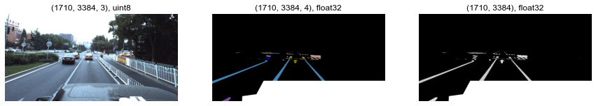</img>
- 原mask按车道线颜色、形状等标注了33个类别，本项目只需要把对应的`id`类别合并为8类`train_id`   
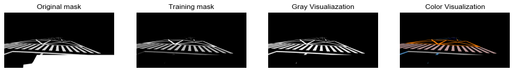</img>
- 原图上半部分有大量亮色天空区域，需要预处理去掉，免得影响识别车道线   
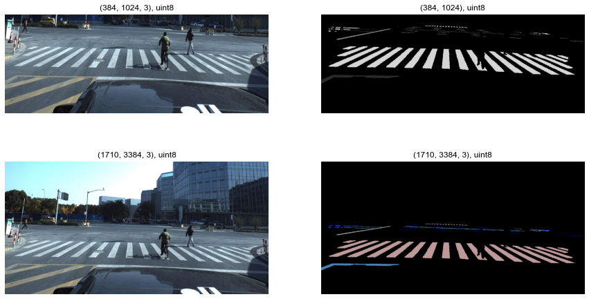</img>
- 随机抽检mask类别，除去类别0为背景肯定占大多数以外，其他类别仍存在明显的imbalanced classes问题   
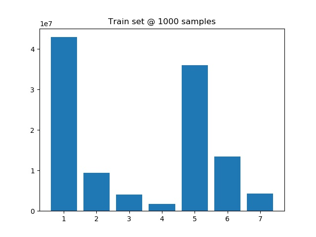</img>
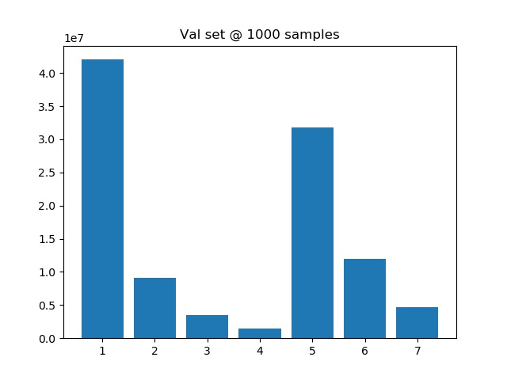</img>


### Models
- Deeplabv3p: 以ResNet代替Xception作为backbone encoder，根据下采样倍数和dilation rate的选择，模型结构稍有不同
- Unet和Unetpp：以ResNet作为backbone，尝试基础unet以及添加更多bridges的unetpp结构，尽可能提升分割还原的精度
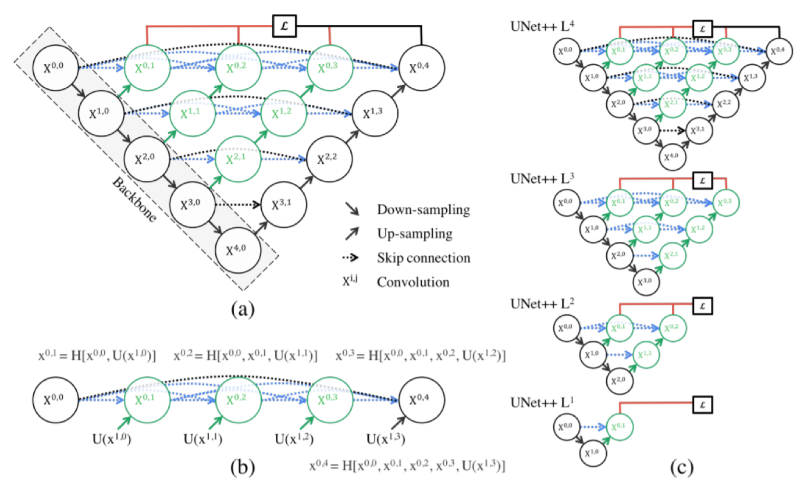</img>

通过run.sh和`config.py`自定义在不同模型结构，以及损失函数搭配下训练，然后进行对比实验：
```
python main.py --model=deeplabv3p --backbone=resnet101 --epochs=5
```


### Evaluation
对比结果：

| 模型 | 骨干 | OS | Dilation | Mean IOU | IOU |
| :-- | -- | -- | -- |-- |-- | 
| DeepLabV3| Resnet101 |16|[1,2,4]| 0.7119| 0.99, 0.75, 0.66, 0.60, 0.56, 0.73, 0.77, 0.63|
| UNet++ (L4) | Resnet50 |-|-|||

验证的时候检查模型个类别的iou情况(前几个epochs绘图时不小心重叠了)：   
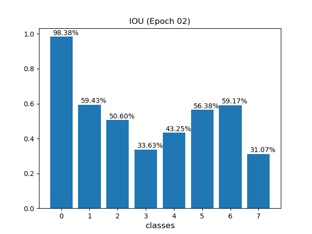

Training log demo:
```
Training log @ running_log/deeplabv3p_resnet101
Device: cuda

** Dataset setting **
training_samples = 17531
val_samples = 4383
batch_size = 8

** Model setting **
Model: DeeplabV3p (resnet101)
os = 16
dilation = [1, 2, 4]

** Training setting **
criterion = 10*focal_loss and dice_loss
optimizer = Adam
epochs = 5

** Start training here! **
            |------------- TRAIN -------------|------------------------------------ VALID ------------------------------------|
epoch   lr  |focal_loss  dice_loss  mean_iou  |focal_loss  dice_loss  mean_iou                       iou                      |    time    
----------------------------------------------------------------------------------------------------------------------------------------
  1   1e-03 |  0.0718     0.8416     0.2120   |  0.0527     0.0000     0.1771   0.97, 0.35, 0.01, 0.00, 0.00, 0.07, 0.02, 0.00|00h 30m 53s 
  2   1e-03 |  0.0401     0.7752     0.3791   |  0.0000     0.0000     0.0000   0.00, 0.00, 0.00, 0.00, 0.00, 0.00, 0.00, 0.00|01h 01m 40s 
  3   1e-03 |  0.0374     0.0000     0.4234   |  0.0277     0.0000     0.5399   0.98, 0.59, 0.51, 0.34, 0.43, 0.56, 0.59, 0.31|01h 37m 31s 
Saving epoch 3 max mean iou model: 0.5399
  4   1e-03 |  0.0360     0.0000     0.4417   |  0.0265     0.0000     0.5581   0.98, 0.60, 0.48, 0.41, 0.42, 0.57, 0.57, 0.44|02h 13m 11s 
Saving epoch 4 max mean iou model: 0.5581
  5   6e-04 |  0.0311     0.0000     0.4975   |  0.0225     0.0000     0.5752   0.99, 0.66, 0.58, 0.27, 0.47, 0.61, 0.63, 0.41|02h 49m 27s 
Saving epoch 5 max mean iou model: 0.5752
```


### Prediction
- 预测单张图片
```
python main.py --model=deeplabv3p --backbone=resnet101 --pretrained_model=global_max_mean_iou_model.pth --mode=infer --image_path='test.jpg' --color_mode=True
```
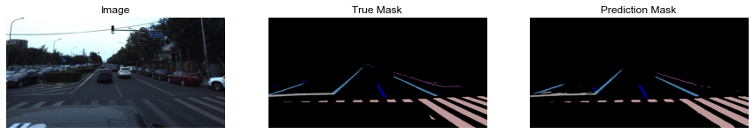</img>

- 网页服务端  
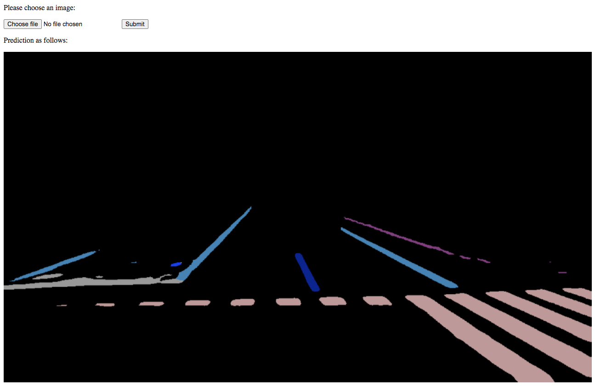</img>

- 预测动态视频，由于不同素材的实际情况和原训练集稍有不同，如右图的行车记录仪视频，先预处理把图下方车子的部分去掉，再剪裁天空resize输入模型  
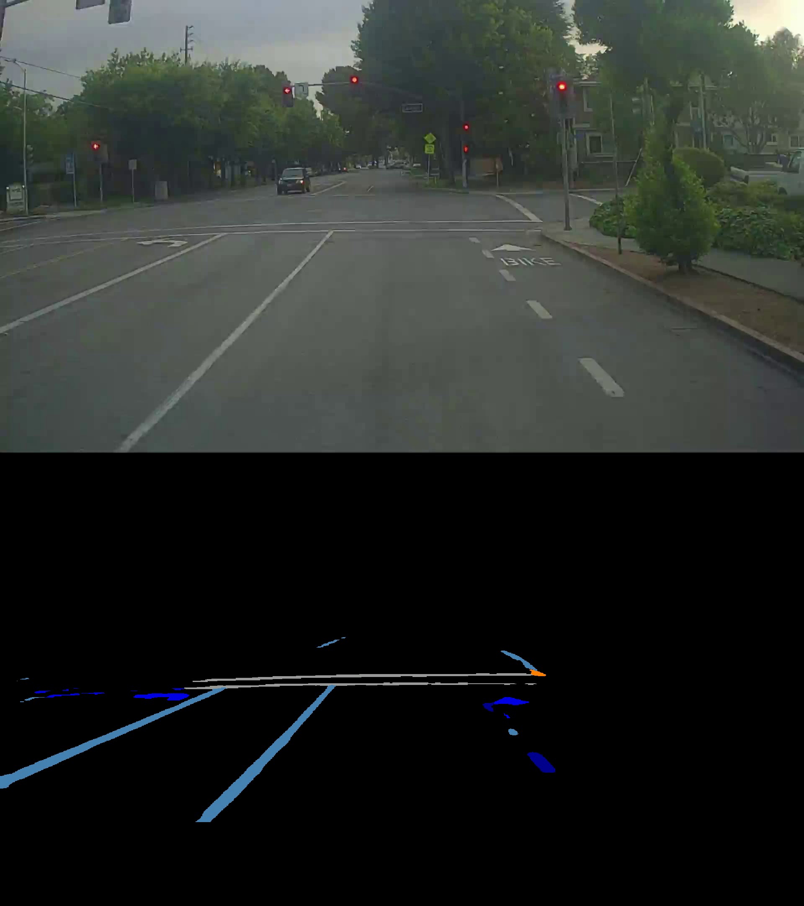</img>
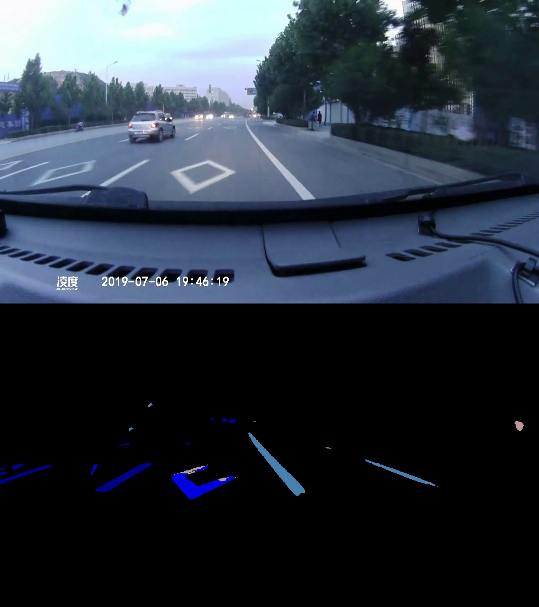</img>